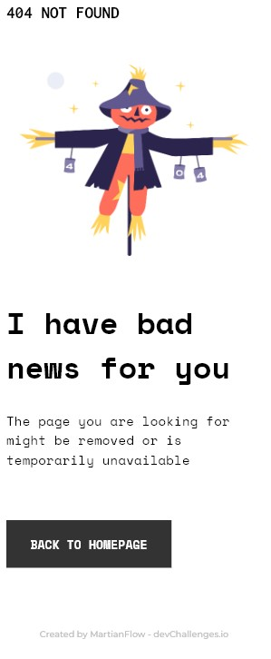
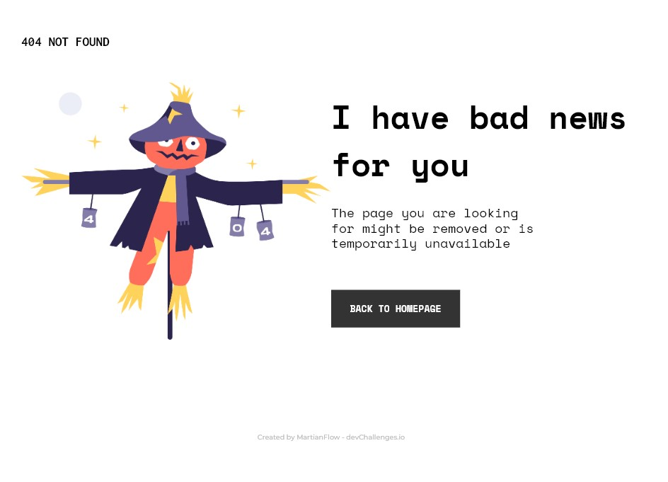

# DEVCHALLENGES.IO - 404 Not Found

This is a solution to the [404 Not Found Challenge](https://devchallenges.io/challenges/wBunSb7FPrIepJZAg0sY). DEVCHALLENGES challenges help you improve your coding skills by building realistic projects. 

## Table of contents 📝✒️

- [Overview](#overview)
  - [The challenge](#the-challenge)
  - [Screenshot](#screenshot)
  - [Links](#links)
- [My process](#my-process)
  - [Built with](#built-with)
  - [What I learned](#what-i-learned)
- [Author](#author)


## 📇 Overview 📇

### The challenge ✔️

- Challenge: Create a 404 not found page following the design. The page should be responsive. Don’t look at the existing solution. Fulfill user stories below:

- User story: I can see a page following the given design

### Screenshot: 🪟

#### Mobile 📱


#### Desktop 💻


### Links 🔗

- Solution URL: [GitHub](https://github.com/MartianFlow/challengue-social-proof-section-master)
- Live Site URL: [LiveSite](https://martianflow.github.io/challengue-social-proof-section-master/)

## 🧩 My process 🧩

### Built with  🛠

- Semantic HTML5 markup
- CSS custom properties
- CSS Grid
- Mobile-first workflow

### What I learned 🥇

I learned to use:

```css

Use of:
grid-template-areas {}
grid-template-columns {}
grid-area: {}

```

## Author 👽

- Website - [GitHub](https://github.com/MartianFlow)
- DEVCHALLENGES - [@MartianFlow](https://devchallenges.io/portfolio/MartianFlow)
- Twitter - [@Martian__Flow](https://twitter.com/Martian__Flow)


#  Have fun building! 🚀